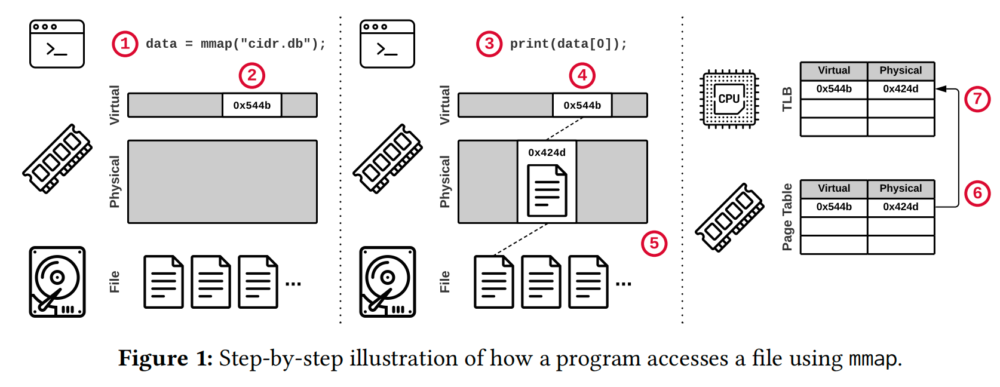

## What's MMAP (💩)？

MMAP is a system call that maps a file into memory. It is a common technique for database systems to access data.

### MMAP OverView

Figure 1 shows a step-by-step overview of how to access a file
(“cidr.db”) with mmap. 
1. A program calls mmap and receives a
pointer to the memory-mapped file contents.
2. The OS reserves
part of the program’s virtual address space but does not load any
part of the file. 
3. The program accesses the file’s contents using the
pointer. 
4. The OS attempts to retrieve the page. 
5. Since no valid
mapping exists for the specified virtual address, the OS triggers a
page fault to load the referenced part of the file from secondary
storage into a physical memory page. 
6. The OS adds an entry to
the page table that maps the virtual address to the new physical
address. 
7. The initiating CPU core also caches this entry in its local
translation lookaside buffer (TLB) to accelerate future accesses.

### MMAP Benifits
 1. easy use and low engineering cost
 2. does not incur the cost of explicit system calls (i.e., read/write)
 3. avoids redundant copying to a buffer in user space

### Problems with MMAP

### When we might consider using MMAP ?

## Reference

- [Are You Sure You Want to Use MMAP in Your
Database Management System?](https://db.cs.cmu.edu/mmap-cidr2022/)

- https://questdb.io/blog/2020/08/19/memory-mapping-deep-dive/
